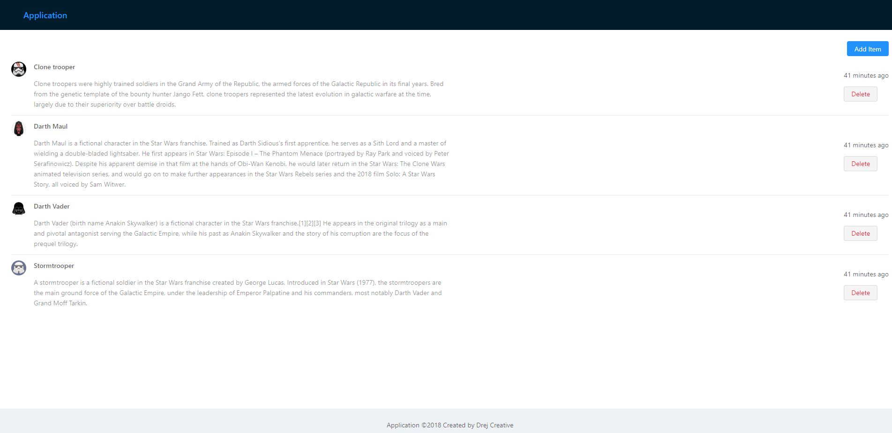

# MERN Stack simple application - Docker

This is simple **MERN stack** Application, something like a boilerplate for future development. 
**Mongo** is used for database, backend is builed on top of **NodeJs** with **ExpressJs**. We used latest Node 10 with es6 syntax with `--experimental-modules` flag. Frontend is **React** with **Redux** for state managment. 

Database has own **Docker** container, and Frontend and backend part are in another **Docker** container.

## technology stack
| Datavase        | Backend           | Frontend  |
| --------------- |:-----------------:| ---------:|
| MongoDB         | NodeJs            | ReactJs   |
|                 | ExpressJs         | Redux     |
|                 | mongoose          | AntDesign |

Frontend part of the project was generated with [create-react-app](https://github.com/facebookincubator/create-react-app)

## Development server
You need to have `DOCKER` installed
[Download Docker](https://www.docker.com/get-started)

Run `docker-compose up` for a dev server. After it download and build Docker containers you can visit application on `http://localhost/`